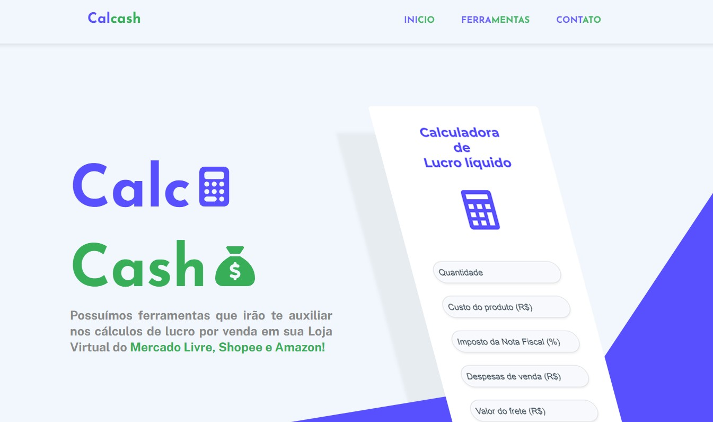

# Calcash

Bem-vindo ao repositório do **Calcash**, uma ferramenta desenvolvida inteiramente em React.js e Node.js, projetada por Matheus Bomtempo e Thaian Ramalho. O Calcash é uma calculadora de percentual de lucro ideal para vendedores que atuam em plataformas como Mercado Livre, Shopee e Amazon.

Experimente o Calcash acessando [https://calcash.com.br/](https://calcash.com.br/).

## Preview do Projeto

## Sobre o Projeto

O objetivo do Calcash é simplificar o cálculo de lucros para vendedores online, fornecendo uma ferramenta fácil de usar que automaticamente calcula o percentual de lucro sobre as vendas após considerar as taxas aplicáveis de cada plataforma.

### Funcionalidades

- **Cálculo de Lucro Percentual:** Insira o custo do produto e o preço de venda para ver seu lucro percentual.
- **Suporte a Múltiplas Plataformas:** Calculadora personalizada para Mercado Livre, Shopee, Amazon, e outras.
- **Interface Intuitiva:** Desenvolvida com React.js para uma experiência do usuário suave e responsiva.

## Tecnologias Utilizadas

- **React.js:** Para a construção de uma interface de usuário dinâmica.
- **Node.js:** Para serviços backend e manipulação de dados.

- Design Desenvolvido no **Figma** por Matheus Bomtempo.

## Licença

Este projeto está licenciado sob a Licença MIT - veja o arquivo [LICENSE.md](LICENSE.md) para mais detalhes.

---

Feito por Thaian Ramalho e Matheus Bomtempo.
